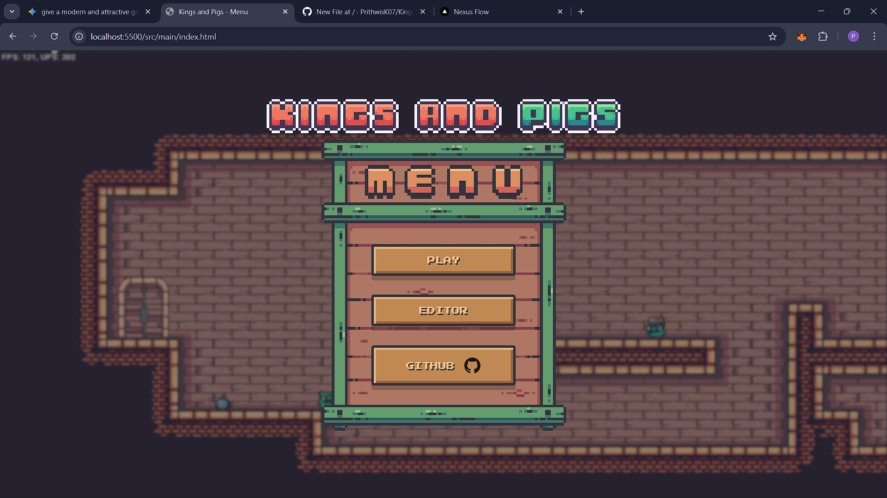
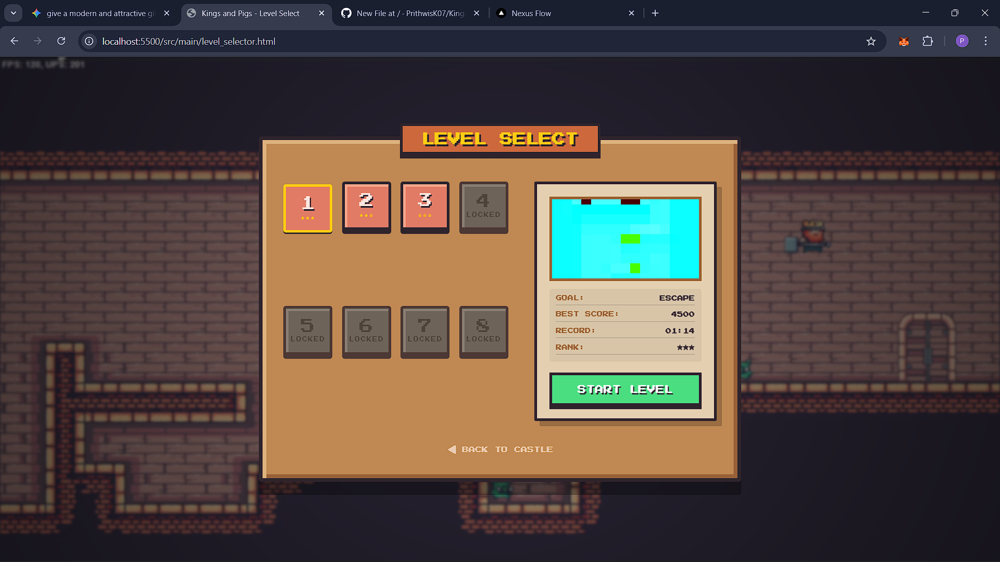
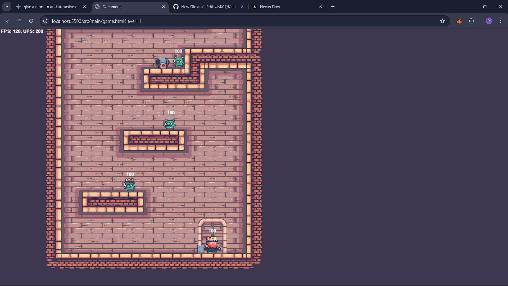

# Kings and Pigs

A browser-based 2D platformer and level editor built with HTML5 Canvas and modular JavaScript.

## Overview

This project is a complete game project combining a playable action platformer with a level editor. The player controls a king character who navigates tile-based levels, battles enemy pigs, avoids hazards, and interacts with doors and environmental objects.

The codebase is divided into two main parts:
- `src/main/` – game UI, menu, level select screen, game canvas, and editor interface
- `src/` – core game engine, level loading, entities, objects, inputs, and utilities

### Static Screen Previews

### Tile Editor Preview

## How to Play

### Launching the game
1. Open `src/main/index.html` in a browser.
2. Use the main menu to choose `Play` or `Editor`.
3. In the level selector, choose an unlocked level and click `START LEVEL`.
4. Press `Escape` from the game screen to return to the main menu.

### Player controls
- `A` or `ArrowLeft` – move left
- `D` or `ArrowRight` – move right
- `W` or `ArrowUp` – attempt to enter an entry door
- `Space` – jump
- Left mouse button – attack
- `Escape` – exit game screen or editor, return to menu

### Goals
- Defeat pig enemies
- Use doors to enter and exit levels correctly
- Avoid enemy attacks, projectiles, boxes, and bombs
- Progress through levels by navigating the environment and eliminating threats

## Game Mechanics

### Platforming
- Tile-based world loaded from PNG data
- Player and enemies use tile collision detection via `HelperMethods.js`
- Gravity, jumping, falling, and ground checks are supported for all moving entities
- Camera scrolls around the player using horizontal and vertical border thresholds

### Combat
- Player has a melee attack box that damages nearby enemies
- Enemies have collision-based damage when attacking or throwing objects
- Player automatically regenerates health slowly over time when not dead
- Enemies and player transition through sprite animation states for idle, run, attack, hit, jump, fall, death, and more

### Enemies and hazards
- `Pig` – basic melee enemy that chases and attacks the player
- `KingPig` – stronger enemy with longer chase logic and more damage
- `PigWithBoxes` – carries a box, can throw it, and can pick one back up
- `PigWithBomb` – carries a bomb, throws it, and can pick bombs back up
- `PigWithMatch` – uses matches to fire nearby cannons
- `Cannon` – shoots projectiles at the player
- `Bomb` and `Box` – throwable hazards that explode on collision
- `Projectile` – cannon-fired objects that travel, arc with gravity, and explode

### Level and object interaction
- Entry and exit doors control the timing of starting and leaving levels
- Clicking `W` or `ArrowUp` near an entry door triggers entry animation
- Exit doors open after a countdown and allow the player to finish the level
- Objects are loaded from map pixels and positioned in the world using game data

## Editor Mechanics

The built-in editor is a full design tool for creating tile maps and object layouts.

### Editor features
- tile palette to paint terrain
- enemy palette to place pig enemies and special enemies
- object palette for cannons, doors, bombs, and boxes
- grid generation with custom row/column dimensions
- panning with `Space` + drag
- toggleable grid overlay
- eraser mode
- undo/redo support with `Ctrl+Z` and `Ctrl+Y`
- right-click context menu for placed objects:
  - pick up object
  - flip horizontally
  - mark entry/exit door
  - delete

### Import / export
- The editor can export the tile map as a PNG file
- Level data is encoded inside the image channels so that gameplay can load the level directly from the exported PNG
- Import support reads image pixel data, reconstructs tiles and objects, and restores flipped or door type metadata

## Project Structure

- `src/main/index.html` – main menu
- `src/main/level_selector.html` – level selection UI
- `src/main/game.html` – gameplay canvas container
- `src/main/editor.html` – map editor UI
- `src/main/js/` – editor supporting scripts
- `src/players/`, `src/entities/`, `src/objects/` – game actors and objects
- `src/level/` – level manager and level definitions
- `src/utilities/` – game utilities, helper methods, constants, sprite loading
- `src/main/Main.js` – game entry point
- `src/main/Game.js` – game loop and main world update/render logic

## Technical Notes

### Level format
- Game levels are parsed from PNG files using pixel values
- Red channel encodes terrain tile indices
- Blue channel encodes object/enemy types
- Green channel encodes metadata such as flip state and door type

### Sprite handling
- Assets are loaded using image atlas techniques
- Animation frames are extracted from spritesheets based on entity states

### Engine design
- The game uses a fixed-step update loop with separate render and update timing
- Entities share collision helpers and a simple `Rectangle2D` bounding-box system
- The world uses an offscreen canvas representation of the level for efficient rendering

## Running the Project

This project does not require a build tool. It can be run as a static website.

### Recommended
1. Serve the `src/` directory with a local web server.
   - Example (Python): `python -m http.server 8000`
   - Example (Node): `npx http-server src`
2. Open `http://localhost:8000/main/index.html`

### Quick open
- If your browser allows file-based assets, open `src/main/index.html` directly
- Note: some browsers may block local image loading when opened via `file://`, so a local server is more reliable

## Notes

- The current world loader points to a single tile and level image path in `src/level/Levels.js`
- The project is structured for extension: new levels, enemy types, and game mechanics can be added by expanding the PNG map data and section constants

## Author
- Project structure and game logic implemented in modular JavaScript

---

Enjoy exploring the game and building new levels with the editor!